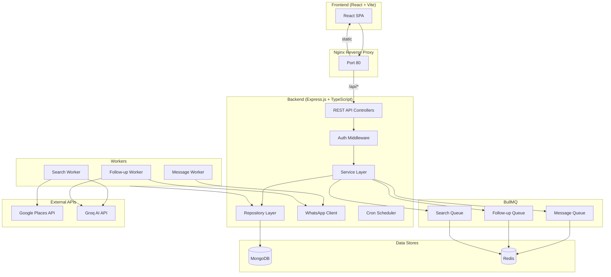

# AI Lead Generation SaaS — Implementation Plan

## Overview

Build a production-ready, single-user AI-powered Lead Generation SaaS that automates discovering local businesses without websites, qualifying them with AI (Groq), and reaching out via personalized WhatsApp messages. The app replaces manual Google Maps hunting with an end-to-end automated pipeline.

---

## User Review Required

> [!IMPORTANT]
> **Tailwind CSS version**: The prompt specifies Tailwind CSS v3. I will use **Tailwind CSS v3.4** (stable). If you want v4, let me know.

> [!IMPORTANT]
> **Frontend bundler**: The prompt says "React 18 with TypeScript" but doesn't specify a bundler. I'll use **Vite** (with `react-ts` template) since it's the modern standard for React SPAs. The Docker setup will build to static files served by Nginx.

> [!WARNING]
> **whatsapp-web.js in Docker**: Puppeteer/Chromium is resource-heavy. The Docker image will be ~1.5GB+ due to Chromium. The `WHATSAPP_SESSION_PATH` will be mounted as a Docker volume so QR scan persists across restarts.

> [!CAUTION]
> **WhatsApp Terms of Service**: Using `whatsapp-web.js` for automated messaging violates WhatsApp's ToS. This is a personal tool — use at your own risk. Rate-limiting (4s between messages) is built in to reduce detection risk.

---

## Open Questions

> [!IMPORTANT]
> **MongoDB**: Should I use a local MongoDB instance (via Docker Compose) or do you have an existing MongoDB Atlas URI you'd like to use? The plan assumes Docker-local MongoDB with an option to swap via `MONGODB_URI` env var.

> [!IMPORTANT]
> **Redis**: Same question — Docker-local Redis or an existing Upstash Redis URL? The plan assumes Docker-local with Upstash compatibility (standard Redis protocol).

> [!IMPORTANT]
> **Google Places API key**: Do you already have a Google Cloud project with Places API (New) enabled? This is required before the search feature works.

---

## Architecture Diagram



---

## Dependency Versions

### Backend (`backend/package.json`)
| Package | Version | Purpose |
|---------|---------|---------|
| `express` | `^4.21` | HTTP framework |
| `mongoose` | `^8.9` | MongoDB ODM |
| `ioredis` | `^5.4` | Redis client |
| `bullmq` | `^5.31` | Job queue |
| `zod` | `^3.24` | Schema validation |
| `jsonwebtoken` | `^9.0` | JWT auth |
| `bcryptjs` | `^2.4` | Password hashing |
| `groq-sdk` | `^0.12` | Groq AI client |
| `whatsapp-web.js` | `^1.34` | WhatsApp client |
| `qrcode` | `^1.5` | QR code generation |
| `node-cron` | `^3.0` | Cron scheduler |
| `winston` | `^3.17` | Logging |
| `helmet` | `^8.0` | Security headers |
| `cors` | `^2.8` | CORS |
| `express-rate-limit` | `^7.4` | Rate limiting |
| `libphonenumber-js` | `^1.11` | Phone normalization |
| `dotenv` | `^16.4` | Env loading |

### Frontend (`frontend/package.json`)
| Package | Version | Purpose |
|---------|---------|---------|
| `react` | `^18.3` | UI library |
| `react-dom` | `^18.3` | React DOM |
| `react-router-dom` | `^6.28` | Routing |
| `@tanstack/react-query` | `^5.62` | Data fetching |
| `axios` | `^1.7` | HTTP client |
| `recharts` | `^2.14` | Charts |
| `tailwindcss` | `^3.4` | Utility CSS |
| `@heroicons/react` | `^2.2` | Icons |
| `react-hot-toast` | `^2.4` | Toast notifications |
| `qrcode.react` | `^4.2` | QR code React component |

---

## Proposed Changes

### Module 1: Project Scaffold

#### [NEW] [docker-compose.yml](file:///Users/farhan/Desktop/github/lead%20generation%20bot/docker-compose.yml)
Four services: `backend`, `frontend`, `mongo`, `redis`. Volumes for MongoDB data, Redis data, and WhatsApp session persistence. Backend depends on mongo + redis. Frontend served via Nginx.

#### [NEW] [nginx/nginx.conf](file:///Users/farhan/Desktop/github/lead%20generation%20bot/nginx/nginx.conf)
Reverse proxy config: `/*` → static React build, `/api/*` → `backend:5000`, `/webhooks/*` → `backend:5000`.

#### [NEW] [backend/Dockerfile](file:///Users/farhan/Desktop/github/lead%20generation%20bot/backend/Dockerfile)
Multi-stage build: Node.js 20 Alpine + Chromium for Puppeteer. Install deps, compile TypeScript, run with `node dist/index.js`.

#### [NEW] [backend/package.json](file:///Users/farhan/Desktop/github/lead%20generation%20bot/backend/package.json)
All backend dependencies. Scripts: `dev`, `build`, `start`, `seed`.

#### [NEW] [backend/tsconfig.json](file:///Users/farhan/Desktop/github/lead%20generation%20bot/backend/tsconfig.json)
Strict TypeScript config. Target ES2022, module NodeNext, outDir `dist/`.

#### [NEW] [frontend/Dockerfile](file:///Users/farhan/Desktop/github/lead%20generation%20bot/frontend/Dockerfile)
Multi-stage: build React with Vite, serve with Nginx.

#### [NEW] [.env.example](file:///Users/farhan/Desktop/github/lead%20generation%20bot/.env.example)
All environment variables documented with descriptions.

---

### Module 2: Config & DB

#### [NEW] [backend/src/config/env.ts](file:///Users/farhan/Desktop/github/lead%20generation%20bot/backend/src/config/env.ts)
Zod-validated environment variable loader. Parses and validates all required env vars at startup. Fails fast with clear error messages.

#### [NEW] [backend/src/config/db.ts](file:///Users/farhan/Desktop/github/lead%20generation%20bot/backend/src/config/db.ts)
MongoDB connection with Mongoose. Retry logic, connection event logging, graceful shutdown handler.

#### [NEW] [backend/src/config/redis.ts](file:///Users/farhan/Desktop/github/lead%20generation%20bot/backend/src/config/redis.ts)
ioredis client with connection options. Compatible with Upstash Redis (TLS support via URL parsing).

#### [NEW] [backend/src/utils/logger.ts](file:///Users/farhan/Desktop/github/lead%20generation%20bot/backend/src/utils/logger.ts)
Winston logger with console (colorized) and file transports (`logs/error.log`, `logs/combined.log`).

#### [NEW] [backend/src/utils/helpers.ts](file:///Users/farhan/Desktop/github/lead%20generation%20bot/backend/src/utils/helpers.ts)
Utility functions: `catchAsync` wrapper, `AppError` class, phone normalization helper.

---

### Module 3: Models & Repositories

#### [NEW] [backend/src/types/index.ts](file:///Users/farhan/Desktop/github/lead%20generation%20bot/backend/src/types/index.ts)
TypeScript type definitions: `LeadStatus`, `CampaignStatus`, `MessageType`, `MessageStatus`, and all interface types.

#### [NEW] [backend/src/models/Campaign.ts](file:///Users/farhan/Desktop/github/lead%20generation%20bot/backend/src/models/Campaign.ts)
Mongoose schema with schedule, filters, stats subdocuments. Indexes on `status`, `createdAt`.

#### [NEW] [backend/src/models/Lead.ts](file:///Users/farhan/Desktop/github/lead%20generation%20bot/backend/src/models/Lead.ts)
Mongoose schema with unique indexes on `placeId` and `phone`. Compound index on `campaignId + status`. Virtual for computed combined score.

#### [NEW] [backend/src/models/Message.ts](file:///Users/farhan/Desktop/github/lead%20generation%20bot/backend/src/models/Message.ts)
Mongoose schema. Indexes on `leadId`, `campaignId`, `status`.

#### [NEW] [backend/src/models/SearchLog.ts](file:///Users/farhan/Desktop/github/lead%20generation%20bot/backend/src/models/SearchLog.ts)
Mongoose schema for tracking search operations per campaign.

#### [NEW] [backend/src/repositories/CampaignRepository.ts](file:///Users/farhan/Desktop/github/lead%20generation%20bot/backend/src/repositories/CampaignRepository.ts)
CRUD + `findActive()`, `updateStats()`, `updateLastRunAt()`.

#### [NEW] [backend/src/repositories/LeadRepository.ts](file:///Users/farhan/Desktop/github/lead%20generation%20bot/backend/src/repositories/LeadRepository.ts)
CRUD + `findByPhone()`, `findByCampaign()`, `updateStatusByPhone()`, `existsByPlaceId()`, bulk insert with deduplication.

#### [NEW] [backend/src/repositories/MessageRepository.ts](file:///Users/farhan/Desktop/github/lead%20generation%20bot/backend/src/repositories/MessageRepository.ts)
CRUD + `findByLead()`, `saveIncoming()`, `updateStatus()`.

---

### Module 4: Auth

#### [NEW] [backend/src/schemas/authSchemas.ts](file:///Users/farhan/Desktop/github/lead%20generation%20bot/backend/src/schemas/authSchemas.ts)
Zod schemas for login request, refresh token request.

#### [NEW] [backend/src/controllers/authController.ts](file:///Users/farhan/Desktop/github/lead%20generation%20bot/backend/src/controllers/authController.ts)
Login, refresh, logout handlers. JWT access token (15min) + refresh token (7d, HttpOnly cookie).

#### [NEW] [backend/src/middlewares/authMiddleware.ts](file:///Users/farhan/Desktop/github/lead%20generation%20bot/backend/src/middlewares/authMiddleware.ts)
JWT verification middleware. Extracts token from `Authorization: Bearer` header.

#### [NEW] [backend/src/middlewares/validate.ts](file:///Users/farhan/Desktop/github/lead%20generation%20bot/backend/src/middlewares/validate.ts)
Generic Zod validation middleware factory for body/query/params.

#### [NEW] [backend/src/middlewares/errorHandler.ts](file:///Users/farhan/Desktop/github/lead%20generation%20bot/backend/src/middlewares/errorHandler.ts)
Global error handler. Catches `AppError` and Zod validation errors, returns structured JSON responses.

#### [NEW] [backend/src/middlewares/rateLimiter.ts](file:///Users/farhan/Desktop/github/lead%20generation%20bot/backend/src/middlewares/rateLimiter.ts)
Two rate limiters: general (100 req/15min), auth (10 req/15min).

#### [NEW] [backend/src/routes/auth.ts](file:///Users/farhan/Desktop/github/lead%20generation%20bot/backend/src/routes/auth.ts)
Auth routes with validation middleware.

#### [NEW] [backend/src/scripts/seed.ts](file:///Users/farhan/Desktop/github/lead%20generation%20bot/backend/src/scripts/seed.ts)
Admin user seeder. Reads `ADMIN_EMAIL` and `ADMIN_PASSWORD` from env, creates/updates user document.

---

### Module 5: Google Places Service

#### [NEW] [backend/src/services/GooglePlacesService.ts](file:///Users/farhan/Desktop/github/lead%20generation%20bot/backend/src/services/GooglePlacesService.ts)
Full implementation of Google Places API (New) Text Search. Handles pagination (up to 3 pages), field masking, phone normalization to E.164 via `libphonenumber-js`. Filters out businesses with `businessStatus !== 'OPERATIONAL'`.

---

### Module 6: AI Service

#### [NEW] [backend/src/services/AIService.ts](file:///Users/farhan/Desktop/github/lead%20generation%20bot/backend/src/services/AIService.ts)
Groq SDK integration with two methods:
- `qualifyLead()` — JSON mode, returns `{qualified, score, reason}`
- `generateMessage()` — text mode for initial outreach
- `generateFollowUp()` — text mode with original message context
Retry logic with exponential backoff (max 3 retries).

---

### Module 7: Lead Service

#### [NEW] [backend/src/services/LeadService.ts](file:///Users/farhan/Desktop/github/lead%20generation%20bot/backend/src/services/LeadService.ts)
- `calculateScore()` — local scoring (no-website +50, phone +10, rating/review bonuses)
- `processSearchResults()` — filter, deduplicate, AI qualify, persist
- Combined score: `Math.round((localScore + aiScore) / 2)`
- Sort by combined score descending

---

### Module 8: WhatsApp Service

#### [NEW] [backend/src/services/WhatsAppService.ts](file:///Users/farhan/Desktop/github/lead%20generation%20bot/backend/src/services/WhatsAppService.ts)
Singleton `whatsapp-web.js` client with `LocalAuth`. QR event stores base64 PNG (via `qrcode` npm package). `ready` event sets flag. `message` event matches incoming replies by phone → updates lead status. Exposes `sendMessage()`, `getStatus()`, `getQR()`.

---

### Module 9: BullMQ Queues & Workers

#### [NEW] [backend/src/queues/messageQueue.ts](file:///Users/farhan/Desktop/github/lead%20generation%20bot/backend/src/queues/messageQueue.ts)
Message queue with rate limiter `{max: 1, duration: 4000}`. Job options: 3 attempts, exponential backoff.

#### [NEW] [backend/src/queues/searchQueue.ts](file:///Users/farhan/Desktop/github/lead%20generation%20bot/backend/src/queues/searchQueue.ts)
Search queue for campaign processing. Concurrency: 2.

#### [NEW] [backend/src/workers/messageWorker.ts](file:///Users/farhan/Desktop/github/lead%20generation%20bot/backend/src/workers/messageWorker.ts)
Processes WhatsApp send jobs. Calls `WhatsAppService.sendMessage()`, updates Message document status, schedules follow-up via `followUpQueue.add()` with 3-day delay.

#### [NEW] [backend/src/workers/followUpWorker.ts](file:///Users/farhan/Desktop/github/lead%20generation%20bot/backend/src/workers/followUpWorker.ts)
Checks if lead replied → skip. Otherwise generates follow-up message via AI, enqueues to messageQueue. Max 2 follow-ups.

#### [NEW] [backend/src/workers/searchWorker.ts](file:///Users/farhan/Desktop/github/lead%20generation%20bot/backend/src/workers/searchWorker.ts)
Calls GooglePlacesService, processes results through LeadService, updates campaign stats.

---

### Module 10: Campaign Service & Routes

#### [NEW] [backend/src/schemas/campaignSchemas.ts](file:///Users/farhan/Desktop/github/lead%20generation%20bot/backend/src/schemas/campaignSchemas.ts)
Zod schemas for create, update, pagination query.

#### [NEW] [backend/src/services/CampaignService.ts](file:///Users/farhan/Desktop/github/lead%20generation%20bot/backend/src/services/CampaignService.ts)
Full CRUD + start (enqueue search job), pause (update status), stop (update status + remove scheduled jobs).

#### [NEW] [backend/src/controllers/campaignController.ts](file:///Users/farhan/Desktop/github/lead%20generation%20bot/backend/src/controllers/campaignController.ts)
Express handlers for all campaign endpoints.

#### [NEW] [backend/src/routes/campaigns.ts](file:///Users/farhan/Desktop/github/lead%20generation%20bot/backend/src/routes/campaigns.ts)
Campaign routes with auth middleware and validation.

---

### Module 11: Lead, Message & Webhook Routes

#### [NEW] [backend/src/schemas/leadSchemas.ts](file:///Users/farhan/Desktop/github/lead%20generation%20bot/backend/src/schemas/leadSchemas.ts)
Zod schemas for lead queries, updates.

#### [NEW] [backend/src/controllers/leadController.ts](file:///Users/farhan/Desktop/github/lead%20generation%20bot/backend/src/controllers/leadController.ts)
List (filtered, paginated), get, update status/notes, delete, trigger contact.

#### [NEW] [backend/src/routes/leads.ts](file:///Users/farhan/Desktop/github/lead%20generation%20bot/backend/src/routes/leads.ts)

#### [NEW] [backend/src/schemas/messageSchemas.ts](file:///Users/farhan/Desktop/github/lead%20generation%20bot/backend/src/schemas/messageSchemas.ts)

#### [NEW] [backend/src/controllers/messageController.ts](file:///Users/farhan/Desktop/github/lead%20generation%20bot/backend/src/controllers/messageController.ts)
List messages, send manual message, trigger manual follow-up.

#### [NEW] [backend/src/routes/messages.ts](file:///Users/farhan/Desktop/github/lead%20generation%20bot/backend/src/routes/messages.ts)

#### [NEW] [backend/src/controllers/webhookController.ts](file:///Users/farhan/Desktop/github/lead%20generation%20bot/backend/src/controllers/webhookController.ts)
WhatsApp status endpoint (QR + ready state).

#### [NEW] [backend/src/routes/webhooks.ts](file:///Users/farhan/Desktop/github/lead%20generation%20bot/backend/src/routes/webhooks.ts)

---

### Module 12: Cron Scheduler

#### [NEW] [backend/src/cron/scheduler.ts](file:///Users/farhan/Desktop/github/lead%20generation%20bot/backend/src/cron/scheduler.ts)
Daily cron at 2:30 AM UTC (8 AM IST). Finds active campaigns, enqueues search jobs.

---

### Module 13: Analytics Service & Routes

#### [NEW] [backend/src/services/AnalyticsService.ts](file:///Users/farhan/Desktop/github/lead%20generation%20bot/backend/src/services/AnalyticsService.ts)
MongoDB aggregation pipelines for:
- Overview stats (totals, conversion rates)
- Daily counts (last 30 days)
- Top categories and cities

#### [NEW] [backend/src/controllers/analyticsController.ts](file:///Users/farhan/Desktop/github/lead%20generation%20bot/backend/src/controllers/analyticsController.ts)

#### [NEW] [backend/src/routes/analytics.ts](file:///Users/farhan/Desktop/github/lead%20generation%20bot/backend/src/routes/analytics.ts)

---

### Module 14: Backend Entry Point

#### [NEW] [backend/src/index.ts](file:///Users/farhan/Desktop/github/lead%20generation%20bot/backend/src/index.ts)
Main server file. Initializes in order:
1. Load env config
2. Connect MongoDB
3. Connect Redis
4. Initialize WhatsApp client
5. Start BullMQ workers
6. Register Express middleware (helmet, cors, rate limiter, JSON parser)
7. Mount routes
8. Register error handler
9. Start cron scheduler
10. Listen on PORT
11. Graceful shutdown handler (close DB, Redis, WhatsApp client, workers)

---

### Module 15: Frontend Setup & Auth

Initialize Vite project with `react-ts` template. Install Tailwind CSS v3.4, React Router v6, TanStack Query v5, Axios, Recharts, Heroicons.

#### [NEW] [frontend/src/api/client.ts](file:///Users/farhan/Desktop/github/lead%20generation%20bot/frontend/src/api/client.ts)
Axios instance with base URL `/api`, interceptors for JWT injection and 401 redirect. Token refresh on 401.

#### [NEW] [frontend/src/hooks/useAuth.ts](file:///Users/farhan/Desktop/github/lead%20generation%20bot/frontend/src/hooks/useAuth.ts)
Auth context provider with login/logout/refresh functions. Stores access token in memory, refresh token in HttpOnly cookie (server-set).

#### [NEW] [frontend/src/pages/LoginPage.tsx](file:///Users/farhan/Desktop/github/lead%20generation%20bot/frontend/src/pages/LoginPage.tsx)
Premium login page with gradient background, glassmorphism card, email/password form.

#### [NEW] [frontend/src/components/layout/Sidebar.tsx](file:///Users/farhan/Desktop/github/lead%20generation%20bot/frontend/src/components/layout/Sidebar.tsx)
Dark sidebar with navigation links (Dashboard, Campaigns, Leads, Messages, Analytics), WhatsApp connection status indicator, logout button.

#### [NEW] [frontend/src/components/layout/TopBar.tsx](file:///Users/farhan/Desktop/github/lead%20generation%20bot/frontend/src/components/layout/TopBar.tsx)
Top bar with page title, search input, WhatsApp status badge.

#### [NEW] [frontend/src/App.tsx](file:///Users/farhan/Desktop/github/lead%20generation%20bot/frontend/src/App.tsx)
React Router setup with protected routes, layout wrapper, TanStack Query provider.

---

### Module 16: Frontend Dashboard

#### [NEW] [frontend/src/pages/DashboardPage.tsx](file:///Users/farhan/Desktop/github/lead%20generation%20bot/frontend/src/pages/DashboardPage.tsx)
6 stat cards with animated counters, conversion rate badge, Recharts line chart (leads/day, 14 days), recent campaigns list.

#### [NEW] [frontend/src/components/ui/StatCard.tsx](file:///Users/farhan/Desktop/github/lead%20generation%20bot/frontend/src/components/ui/StatCard.tsx)
Glassmorphism stat card with icon, value, label, trend indicator.

#### [NEW] [frontend/src/components/ui/Badge.tsx](file:///Users/farhan/Desktop/github/lead%20generation%20bot/frontend/src/components/ui/Badge.tsx)
Status badge component with color variants.

#### [NEW] [frontend/src/components/ui/EmptyState.tsx](file:///Users/farhan/Desktop/github/lead%20generation%20bot/frontend/src/components/ui/EmptyState.tsx)
Empty state illustration with CTA button.

---

### Module 17: Frontend Campaigns

#### [NEW] [frontend/src/pages/CampaignsPage.tsx](file:///Users/farhan/Desktop/github/lead%20generation%20bot/frontend/src/pages/CampaignsPage.tsx)
Card grid layout with campaign cards, "New Campaign" button.

#### [NEW] [frontend/src/components/campaigns/CampaignCard.tsx](file:///Users/farhan/Desktop/github/lead%20generation%20bot/frontend/src/components/campaigns/CampaignCard.tsx)
Card with status badge, category/city, stats bar (leads/contacted/replied), action buttons (Start/Pause/Stop).

#### [NEW] [frontend/src/components/campaigns/CreateCampaignModal.tsx](file:///Users/farhan/Desktop/github/lead%20generation%20bot/frontend/src/components/campaigns/CreateCampaignModal.tsx)
Modal with form: Name, Category, City, Country, Min Rating slider, Min Reviews input, Schedule toggle + cron time picker.

#### [NEW] [frontend/src/hooks/useCampaigns.ts](file:///Users/farhan/Desktop/github/lead%20generation%20bot/frontend/src/hooks/useCampaigns.ts)
TanStack Query hooks for campaign CRUD operations.

---

### Module 18: Frontend Leads

#### [NEW] [frontend/src/pages/LeadsPage.tsx](file:///Users/farhan/Desktop/github/lead%20generation%20bot/frontend/src/pages/LeadsPage.tsx)
Data table with filters sidebar, pagination, bulk CSV export button.

#### [NEW] [frontend/src/components/leads/LeadTable.tsx](file:///Users/farhan/Desktop/github/lead%20generation%20bot/frontend/src/components/leads/LeadTable.tsx)
Table with columns: Business Name, Category, City, Rating, Reviews, AI Score (color-coded), Status badge, Last Contact. Row click → drawer.

#### [NEW] [frontend/src/components/leads/LeadFilters.tsx](file:///Users/farhan/Desktop/github/lead%20generation%20bot/frontend/src/components/leads/LeadFilters.tsx)
Filter panel: Campaign dropdown, Status multi-select, Min Score slider, City search input.

#### [NEW] [frontend/src/components/leads/LeadDetailDrawer.tsx](file:///Users/farhan/Desktop/github/lead%20generation%20bot/frontend/src/components/leads/LeadDetailDrawer.tsx)
Slide-over drawer with full lead details, message history timeline, manual status update dropdown, "Send Message" button, notes textarea.

---

### Module 19: Frontend Messages & Analytics

#### [NEW] [frontend/src/pages/MessagesPage.tsx](file:///Users/farhan/Desktop/github/lead%20generation%20bot/frontend/src/pages/MessagesPage.tsx)
Chronological message feed. Each entry: business name, type badge, content preview, status chip, timestamps.

#### [NEW] [frontend/src/pages/AnalyticsPage.tsx](file:///Users/farhan/Desktop/github/lead%20generation%20bot/frontend/src/pages/AnalyticsPage.tsx)
- Bar chart: Top 5 categories by leads
- Bar chart: Top 5 cities by leads
- Line chart: Messages sent vs read (30 days)
- Funnel: Leads → Qualified → Contacted → Replied → Interested → Converted

---

### Module 20: Docker Compose Final Wiring

#### [MODIFY] [docker-compose.yml](file:///Users/farhan/Desktop/github/lead%20generation%20bot/docker-compose.yml)
Final wiring: health checks for all services, proper depends_on with condition `service_healthy`, environment variable passthrough, volume mounts.

---

## Build Sequence

| # | Module | Est. Files | Depends On |
|---|--------|-----------|------------|
| 1 | Project Scaffold | 7 | — |
| 2 | Config & DB | 5 | 1 |
| 3 | Models & Repositories | 8 | 2 |
| 4 | Auth | 8 | 3 |
| 5 | Google Places Service | 1 | 2 |
| 6 | AI Service | 1 | 2 |
| 7 | Lead Service | 1 | 3, 5, 6 |
| 8 | WhatsApp Service | 1 | 2 |
| 9 | BullMQ Queues & Workers | 5 | 7, 8 |
| 10 | Campaign Service & Routes | 4 | 9 |
| 11 | Lead/Message/Webhook Routes | 7 | 7, 8 |
| 12 | Cron Scheduler | 1 | 9 |
| 13 | Analytics Service & Routes | 3 | 3 |
| 14 | Backend Entry Point | 1 | All backend |
| 15 | Frontend Setup & Auth | 7 | — |
| 16 | Frontend Dashboard | 4 | 15 |
| 17 | Frontend Campaigns | 4 | 15 |
| 18 | Frontend Leads | 4 | 15 |
| 19 | Frontend Messages & Analytics | 2 | 15 |
| 20 | Docker Compose Final | 1 | All |

**Total: ~75 files**

---

## Verification Plan

### Automated Checks
```bash
# Backend TypeScript compilation
cd backend && npx tsc --noEmit

# Frontend TypeScript compilation  
cd frontend && npx tsc --noEmit

# Docker Compose build
docker compose build

# Docker Compose up (full stack)
docker compose up -d

# Verify all services healthy
docker compose ps
```

### Manual Verification
1. **Auth flow**: Login with seeded admin credentials, verify JWT token rotation
2. **Campaign CRUD**: Create campaign, verify it appears in list
3. **Search trigger**: Start campaign, verify Google Places API calls and lead persistence
4. **AI scoring**: Verify Groq API returns valid scores and messages
5. **WhatsApp**: Scan QR code on frontend, verify ready state
6. **Message send**: Contact a lead, verify WhatsApp message delivery
7. **Follow-ups**: Verify delayed follow-up jobs are scheduled
8. **Analytics**: Check dashboard stats update after campaign run
9. **Full E2E**: Create campaign → Start → Leads appear → Contact → Message sent → Check analytics

### Startup Verification
```bash
# Seed admin user
cd backend && npm run seed

# Start dev servers
cd backend && npm run dev
cd frontend && npm run dev
```
